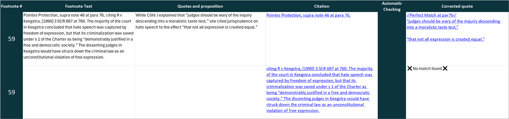

# ALR Quote Verifier

ALR Quote Verifier reads footnotes from Microsoft Word documents, separates
their citations, resolves supported sources, checks quoted text, and produces
an Excel workbook for human review. Canadian cases, legislation, and ALR journal
articles get linked automatically, including a direct link right to the relevant
page, paragraph, or section where possible. Using [A2AJ's free API](https://a2aj.ca/data/), quotes get checked against their sources:
you can see if the supplied quote matches the source, and whether it's at the pinpoint specified,
or at a different pinpoint. If it's partially matching, you see what parts of the quote were changed.
This save enormous time in the law review editing process, and may assist other legal research
endeavours as well.

## Example workbook

## Download for Windows

Download the latest ZIP and its SHA-256 checksum from the
[GitHub releases page](https://github.com/AlbertaLawReview/ALR-Verifier/releases/latest).
Keep the files together and verify the checksum before running the application.

## Install and run

Python 3.11 or newer is recommended. Tk must be available in the Python
installation.

    python -m venv .venv
    .venv\Scripts\Activate.ps1
    python -m pip install -r requirements.txt
    python gui.py

On macOS or Linux, activate the environment with
source .venv/bin/activate. Add or drag one or more DOCX files into the window,
choose the settings, and press Run. Review workbooks are written to
CHECKED_EDITS by default.

An OpenAI API key is required for modes that use AI. Enter it when prompted or
set OPENAI_API_KEY. A key entered in the Windows application is encrypted for
the current Windows user. API usage is billed by OpenAI under your account.

The source tree includes the journal matching and quotation-checking code. The
Windows package includes an Alberta Law Review journal database.

## Processing modes

| Mode | What it does | About 20 pages | About 1,000 pages per year |
| --- | --- | ---: | ---: |
| High accuracy | Uses AI to read every footnote. | $0.75 | $38 |
| Economy | Handles straightforward supra and ibid footnotes without AI. | $0.72 | $36 |
| Ultra economy | Handles clearly structured citations without AI and uses AI when important details are uncertain. | $0.70 | $35 |
| Free | Makes no AI calls; uncertain citations may remain together and linking is less accurate. | $0 | $0 |

The independent Supra linking setting applies in every mode. Safe makes only
high-confidence links. Aggressive also tries two limited ways to recognize
references that Safe leaves unresolved. Safe is the default.

These rough estimates use the GPT-5.2 rates and 20-page test document measured
in July 2026. Actual API cost varies with citation density and model pricing.

## Network access and privacy

Depending on the selected mode and source settings, the application may send
citation or quoted text to OpenAI and may query A2AJ, CourtListener, GovInfo,
the UK National Archives, GOV.UK, and linked source sites. Do not process
confidential material unless that use is permitted by your obligations and by
the applicable service terms. Review each service's current privacy and data
retention policies yourself.

The **A2AJ local corpus** panel can install the complete case-law and
legislation datasets for faster local-first lookups. It checks upstream
partition metadata for staleness, resumes interrupted downloads, and downloads
only changed or new partitions during an update. The separate **Local only**
setting requires that complete corpus and prevents verification runs from
making network requests; journal retrieval and the bundled reference database
are already local. Installing or updating the corpus is an explicit network
operation and currently requires about 4.9 GB of storage.

## Windows package

The downloadable Windows package contains ALR Quote Verifier.exe, the
Alberta Law Review journal database, the project licence, applicable upstream
notices, and a SHA-256 checksum. The executable is digitally signed.

## Test

    python -m pip install -r requirements.txt pytest
    python -X utf8 -m pytest tests -q

CI runs the test suite on Windows, macOS, and Linux with Python 3.11.

## Key contributors

- Eli Ziff
- Martin Rudolf

## License

Copyright 2026 Alberta Law Review.

Project-authored code is licensed under Apache License 2.0. Upstream licenses,
notices, and service terms still apply. See LICENSE, NOTICE, and
THIRD_PARTY_NOTICES.md.

Report security concerns privately as described in SECURITY.md.
